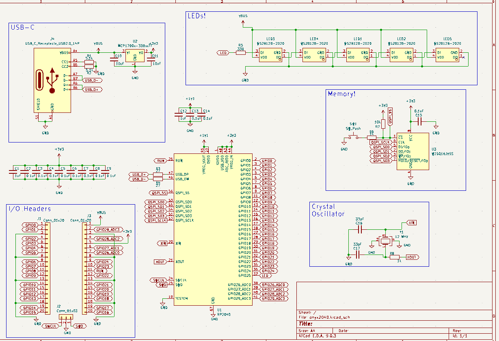
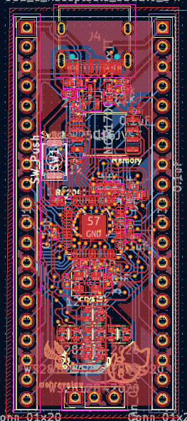
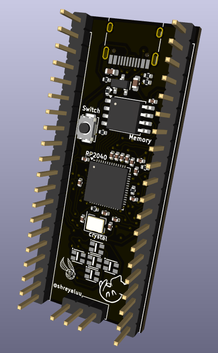
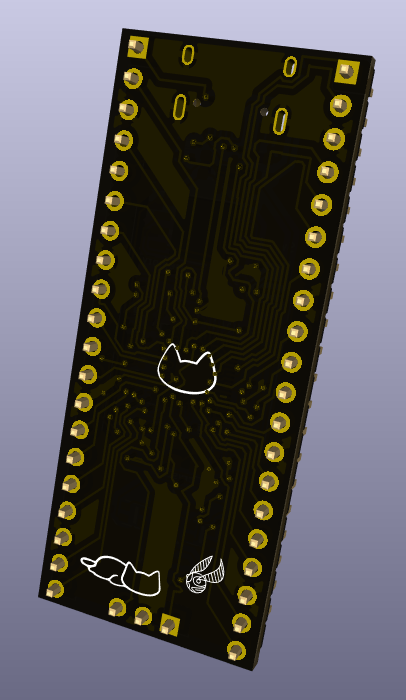

# Onyx2040
This is a devboard powered by the RP2040 chip! It features 40 pins broken out (20 per side) for easy prototyping and a plus‑sign of 5 RGB LEDs to animate whatever your heart desires.

I built this project as a way to learn full PCB design, from schematics to routing to firmware. It’s also a great way for others to prototype their own ideas, with colorful lighting built in to make experimentation more fun and expressive.

## How to Use It?
1. **Power the board** with USB-C
2. To use MicroPython, hold the button (the board will appear as a USB drive named RPI-RP2) and **flash the MicroPython UF2 firmware** with the [MicroPython RP2040 Documentation](https://www.raspberrypi.com/documentation/microcontrollers/micropython.html).
3. Once MicroPython is installed, **copy your Python files** to the board.
4. Then, **experiment!** Use the 40 broken‑out pins (GPIO, power, and ground) to connect sensors, modules, or breadboards. Check out the firmware in the /firmware folder in this repository for an example of how to control the on-board LEDs. Enjoy!

## Images
Here is the **schematic**:

And here is the **finished PCB** in the editor:

This is what the **final devboard** will look like:

